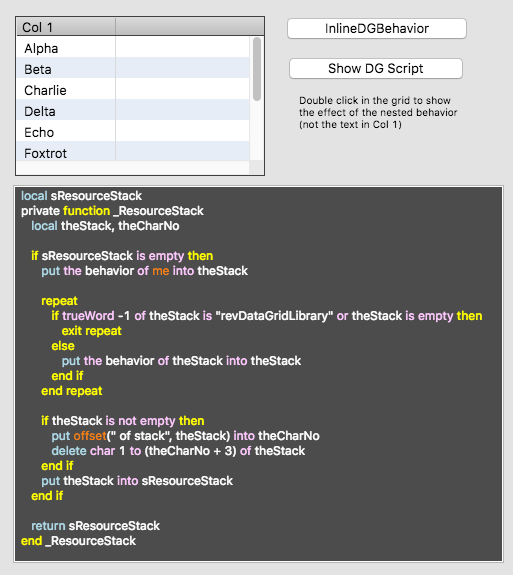

# Nested Data Grid Behavior Demo

This sample stack will replace a function in the Data Grid Library with
one that will support having a user behavior script placed between the
Data Grid group and the library.  This will allow adjustment of the
handlers for a specific data grid instead of attaching it to the end of
the chain where it would impact all data grids in the application.



### Demo Stack

In the stack pictured above, the `InlineDGBehavior` button script is
placed between the data grid on the left and the library code.  All it
currently does is place a `mouseDoubleUp` handler that displays some
information in the message box.

The updated function is displayed in the text field.  That is the actual
code that is inserted into the library when the stack opens.  The code
is only available until LiveCode is quit since IDE stacks are not saved.

The `Show DG Script` button will open the library script to the position
where the code was inserted.

### How to set up the Data Grid

With a newly created Data Grid, do the following in the message box:

```
   set the behavior of button "InlineDGBehavior" to the behavior of \
         group "DataGrid 1"
   set the behavior of group "DataGrid 1" to the long id of \
         button "InlineDGBehavior"
```

This should result with the button having a behavior set to:

```
   button id 1005 of stack "revDataGridLibrary"
```

The stack script (linked below) will also need to be included in the
stack.  The code must be inserted before a data grid is shown or it will
cause an error.

### Links

Here's the thread where this idea originated:
https://www.mail-archive.com/use-livecode@lists.runrev.com/msg95868.html

PR submitted to include a fix in the production version of the IDE:
https://github.com/livecode/livecode-ide/pull/1987

LiveCode Quality Control Center Report
https://quality.livecode.com/show_bug.cgi?id=21427

## Stack Scripts

[Stack Script](./NestedDGBehavior_Scripts/stack_NestedDGBehavior_.livecodescript)

["InlineDGBehavior" Script](./NestedDGBehavior_Scripts/stack_NestedDGBehavior_button_id_1047.livecodescript)

["Show DG Script" Script](./NestedDGBehavior_Scripts/stack_NestedDGBehavior_button_id_1048.livecodescript)